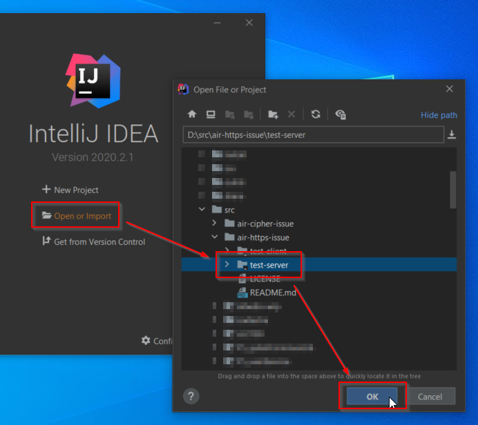

# air-https-issue

Project for the following issue : https://github.com/Gamua/Adobe-Runtime-Support/issues/724

## Run the server

* Import the `test-server` project in your favorite IDE.

 

* Run the static `main` method in the class `fr.adbonnin.issue.App`.

 

## Run the client

* Create a new `Flex Project` in FlashBuilder

 

1. Set the project name to `TestClient`.
2. Select the `test-client` project location.
3. Select the `Desktop` application type.
4. Select your `Flex 4.16.1` SDK.
5. Click on `Finish`.

 

* Right click on the `TestClient.mxml` class.
* Select `Debug As`.
* Click on `Desktop Application`.

 

## Test protocols and cipher suites

1. Set the host name of the test server.
2. Click on the `Load params` button.

 

* The protocols and cipher suites are loaded from test server (see method the `handleParams` of the `App` class).

 

* Click on the `Test` button.

 

* The client will call the server to instantiate a new _test server_ that correspond to the protocol and cipher suite (see the method `handleConfigure`  of the `App` class).
* A request is sent to the _test server_ to test if the protocol or cipher suite is supported (see the method `handleTest` of the `App` class). 

* Click on the `Report` button to print all the result on the right side.

## Sources
List of recommended security protocols by Mozilla :
https://ssl-config.mozilla.org/#server=jetty&version=9.4.28&config=intermediate&guideline=5.6